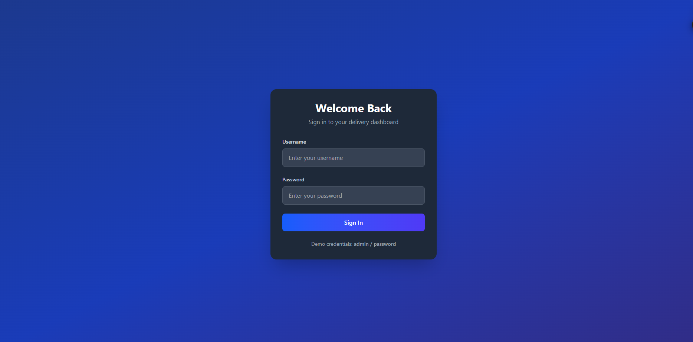
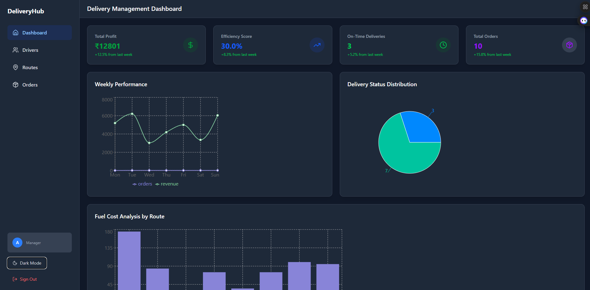
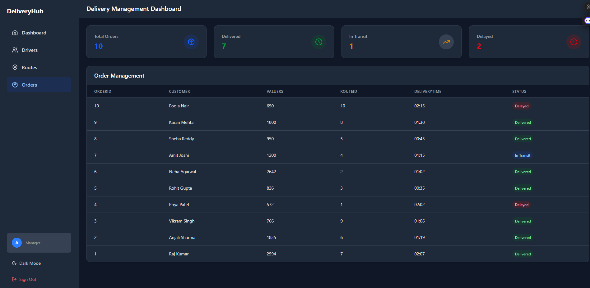

# GreenCart

GreenCart is a full-stack delivery management dashboard built with **React (TypeScript)**, **Node.js (Express)**, **Prisma**, and **PostgreSQL**.  
It helps manage drivers, routes, and orders with real-time metrics and beautiful data visualizations.

## Features
- 📊 **Dashboard KPIs** – Total profit, efficiency, on-time deliveries, total orders
- 🚚 **Driver Management** – View active, on-break, and offline drivers
- 🗺 **Route Management** – Track traffic levels, distances, and popularity
- 📦 **Order Management** – Monitor order statuses and delivery times
- 🌗 **Dark/Light Mode Toggle**
- 🔒 **Authentication** – Simple login system with AuthContext

## Tech Stack
- **Frontend**: React, TypeScript, Tailwind CSS, React Router, Recharts
- **Backend**: Node.js, Express.js, TypeScript
- **Database**: PostgreSQL (via Prisma ORM)
- **Deployment**: Render (Backend + Database)





## Getting Started

### 1. Clone the Repository
```bash
git clone https://github.com/sudip200/greencart.git
cd greencart
